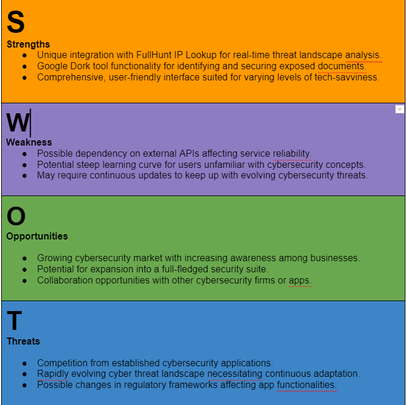
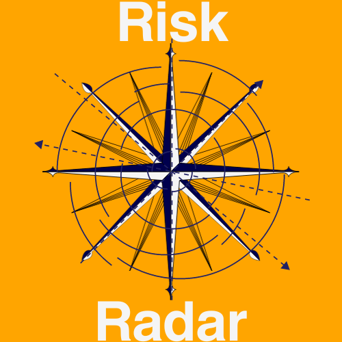

# RiskRadar Documentation

# Purpose

To mitigate cybersecurity risks and enhance application security for businesses.

# Problem Solving

Research

Lack of visibility into threat landscapes and potential data exposure on the web.

# Definition Statement

I want to build an application that leverages the FullHunt IP Lookup API and help businesses assess their threat landscape and identify exposed documents on the web for improved cybersecurity.

Add in a google dorking tool functionality if time allows.

# Audience

IT Security Managers, Small Business Owners, and other stakeholders concerned with cybersecurity.

# Research

1. **[Coro Cybersecurity](https://www.coro.net/)**
    - **Application Features**:
        - It specializes in monitoring and remediating malicious activity across customer systems, with many of its remediation services being automated.
        - The platform is capable of addressing complex issues that require human intervention.
    - **Pricing**:
        - The general pricing structure for Coro's services starts at $8.99 per user per month when billed annually.
        - Additionally, they offer a more flexible option where you can get your first module for $4 per month and expand as your company grows.
2. **[Palo Alto Networks](https://www.paloaltonetworks.com/)**
    - **Application Features**:
        - Palo Alto Networks provides a wide range of cybersecurity solutions, including their NGFWs (Next-Generation Firewalls).
        - Even their lower-cost firewall appliances include advanced features such as ML-based detection, AIOps policy recommendations, behavioral analysis, IoT device detection, application classification, and adaptive policies for users and groups regardless of the device or location.
    - **Pricing**:
        - The pricing for Palo Alto Networks' NGFWs starts at around $1,000 for their entry-level PA-220 model, while their high-end PA-7000 model starts at around $200,000.

# SWOT Analysis

## Personas

# Content

### Actions:

### Home:

- Text: Introduction to RiskRadar, “Features” “Threat Landscape” “CVSS Feeds”.
- Images: Illustrations showcasing app functionality.
- Navigation: ”Home” “About” “Contact” “Search”
- Option1
    
    [index.html1.pdf](index.html1.pdf)
    
- Option2
    
    [index.html2.pdf](index.html2.pdf)
    

### About Me Page:

- Text: “About Project” “Disclaimer” “About Me”.
- Navigation:”Home” “About” “Contact” “Search”
- about.html
    
    [about.pdf](about.pdf)
    
- Disclaimer as a footer at the bottom in the footer
- About me: as it relates to capstone.

### Contact Page:

- Text: “About Project” “Disclaimer” “About Me”.
- Navigation:”Home” “About” “Contact” “Search”
- contact.html

[contact.pdf](contact.pdf)

- If open source then move to github, if not. Close it down.

### URL Search Page:

- Text: “Results”.
- Query “URL”
- Navigation:”Home” “About” “Contact” “Search”
- search.html
    
    [search.pdf](search.pdf)
    

- What do I want the functionality of each page to be?

- Download as a CSV, and/or PDF

### DataFlow Diagram

- Utilzing the following api’s
    - [https://fullhunt.io/blog/2021/11/10/fullhunt-public-api-release.html](https://fullhunt.io/blog/2021/11/10/fullhunt-public-api-release.html)
    - [https://www.mongodb.com/docs/drivers/node/current/](https://www.mongodb.com/docs/drivers/node/current/)
    - [https://nvd.nist.gov/vuln/data-feeds#APIS](https://nvd.nist.gov/vuln/data-feeds#APIS)
- Diagram
- 

[data flow.pdf](RiskRadar%20Documentation%203dbe441086a5478c9e834f3229af6a49/data_flow.pdf)

## API Information (so far)

- Full Hunt API Documentation
    - [API Information](https://api-docs.fullhunt.io/#introduction)
- CISA RSS FEED XML
    - [https://www.cisa.gov/cybersecurity-advisories/all.xml](https://www.cisa.gov/cybersecurity-advisories/all.xml)

# Attributes

### Color Palette: picked through Coolors.

[RiskRadar Color Palette.pdf](RiskRadar_Color_Palette.pdf)

#FFA500-Orange

#2C363F-Gunmetal

#F2EFEA-Isabelline

### Fonts:

Arial or Helvetica.

### Images:

- Currently only logo.
- Fonts: Arial or Helvetica.
- SVG Logo

### Navigation:

- Intuitive navigation, focusing on desktop, ease of use.

